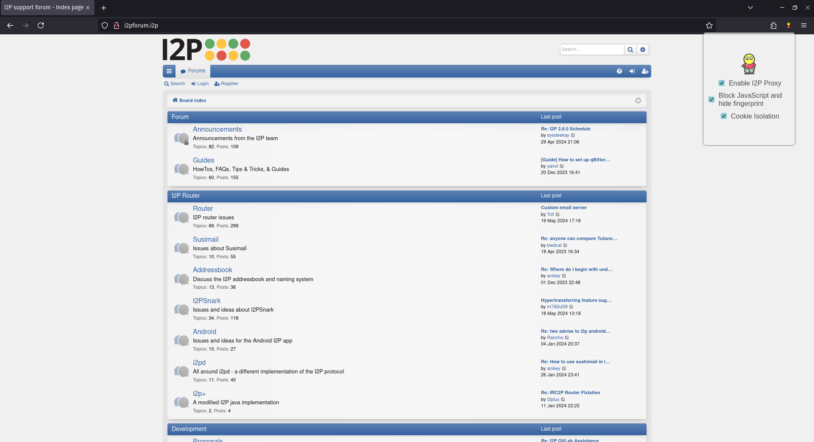

# I2Proxy

<!-- DESCRIPTION -->
## Description:

I2P, which stands for "Invisible Internet Project," is an anonymous network layer that allows for secure and private communication over the internet. It is designed to provide strong anonymity and privacy protections for its users. I2Proxy is a web browser extension that is configured to proxy all traffic through the I2P network, allowing users to access websites and services hosted within the I2P network while maintaining a high level of anonymity.

<!-- FEATURES -->
## Features:

- Blocks JavaScript

- Non-unique fingerprint (Each user looks identical to websites)

- Cookie Isolation

- I2P Proxy Killswitch (prevents data leaks)

<!-- INSTALLATION -->
## Installation:

[Download](https://addons.mozilla.org/en-US/firefox/addon/i2proxy/)

<!-- REQUIREMENTS -->
## Requirements:

- [I2P Router](https://geti2p.net/en/download)

- [Firefox](https://www.mozilla.org/en-US/firefox/new/)

<!-- SCREENSHOT -->
## Screenshot:

<!-- LICENSE -->
## License

Distributed under the MIT License. See `LICENSE` for more information.
